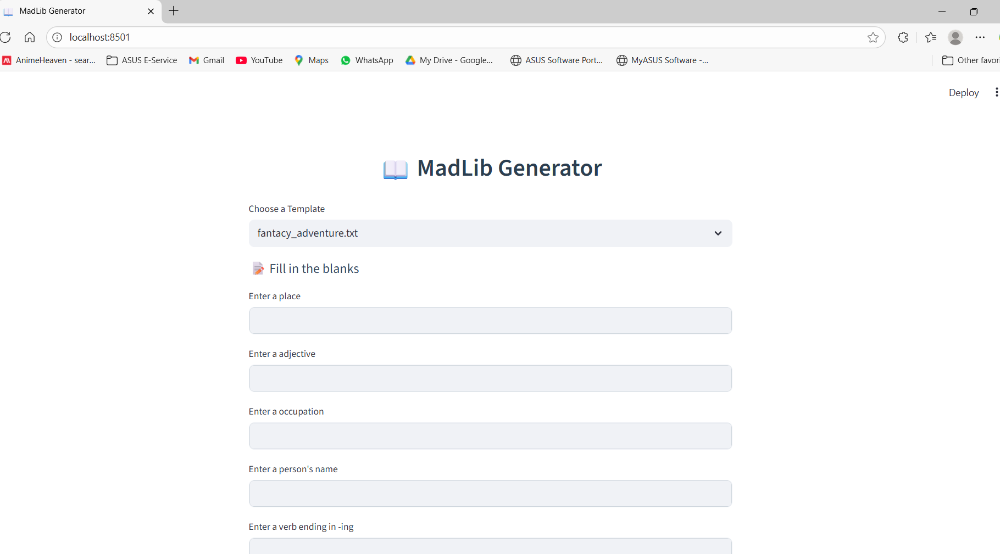
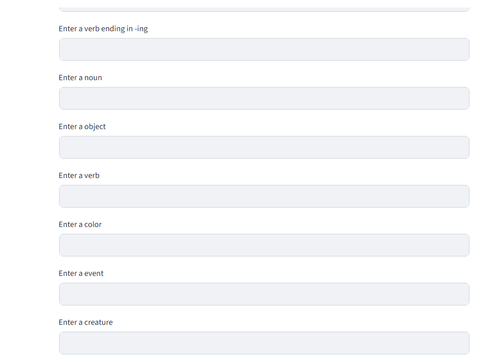
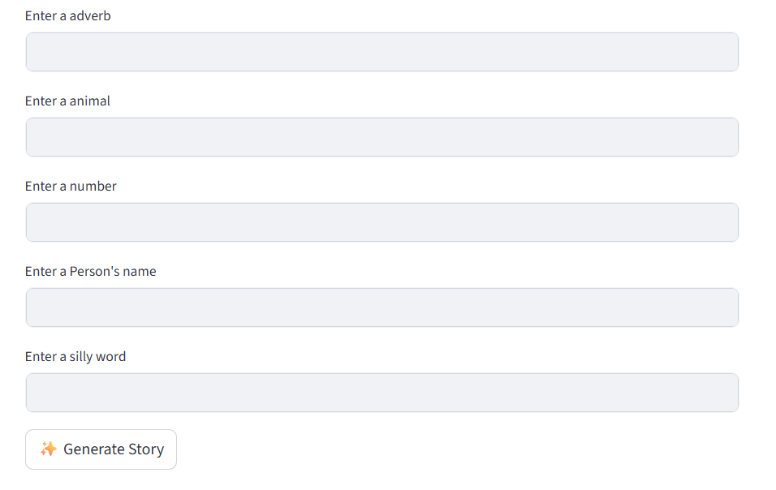
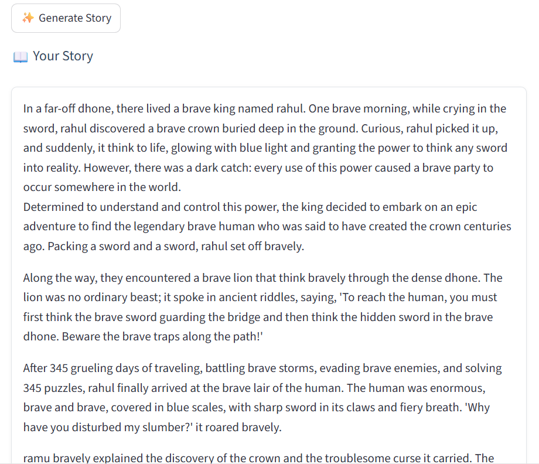
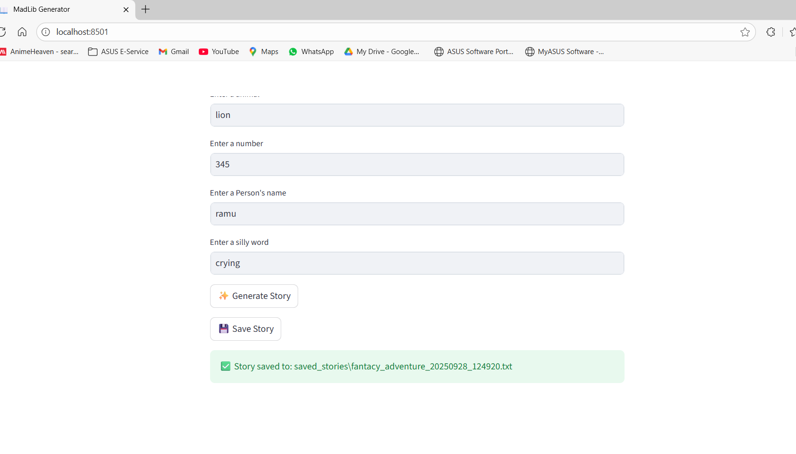

MadLib Generator
A simple interactive story generator built with Streamlit that allows users to create fun stories by filling in the blanks using predefined templates.
Features

Select from various story templates (e.g., fantasy adventure, mystery detective).
Input custom words to fill placeholders in the template.
Generate and view the completed story.
Save the generated story as a text file with a timestamp.

Prerequisites

Python 3.7 or higher
Required Python packages:
streamlit
re

Installation

Clone the repository or download the files.
Install the required packages using pip:pip install streamlit

Ensure the following directory structure:
templates/ (contains .txt files with story templates)
saved_stories/ (where generated stories will be saved)

Usage

Run the Streamlit app:streamlit run main.py

In the browser, select a template from the dropdown menu.
Enter words for each placeholder displayed.
Click "✨ Generate Story" to see the completed story.
Click "💾 Save Story" to save the story to a file in the saved_stories directory.

Directory Structure
MadLib Generator/
├── templates/
│   ├── fantasy_adventure.txt
│   ├── history_lesson.txt
│   ├── mystery_detective.txt
│   └── spacy_odyssey.txt
├── saved_stories/
│   └── (generated files, e.g., fantasy_adventure_20250928_124200.txt)
├── main.py
└── README.md

Customization

Add new templates by creating .txt files in the templates directory with placeholders in the format <placeholder>.
Modify the CSS in main.py under the Page Styling section to adjust the app's appearance.

Troubleshooting

Ensure write permissions are granted for the saved_stories directory.
If the story doesn't save, check the console for permission or file path errors.
Verify all template files are valid .txt files with proper placeholders.

License
This project is open-source. Feel free to modify and distribute as needed.

UI:

Output:

